# CSCE 435 Group project

## 0. Group number: 
Group #3

## 1. Group members:
We will communicate using Discord during the duration of the project.
1. Robbie Clark
2. Eric Lee
3. Rushil Aggarwal
4. Ananth Kumar 

## 2. Project topic (e.g., parallel sorting algorithms)
Parallel Sorting Algorithms

### 2a. Brief project description (what algorithms will you be comparing and on what architectures)
1. Bubble Sort (Sequential) / Odd-Even Sort (Parallel)
    - Sequential
    - Parallel using MPI
    - Parallel using CUDA
2. Merge Sort
    - Sequential
    - Parallel using MPI
    - Parallel using CUDA
3. Selection Sort
    - Sequential
    - Parallel using MPI
    - Parallel using CUDA
4. Quick Sort
    - Sequential
    - Parallel using MPI
    - Parallel using CUDA

### 2b. Pseudocode for each parallel algorithm
- For MPI programs, include MPI calls you will use to coordinate between processes
- For CUDA programs, indicate which computation will be performed in a CUDA kernel,
  and where you will transfer data to/from the GPU

1. Bubble Sort (Sequential)
    ```python
    def bubble_sort(array):
        i = array.length - 1
        sorted = False
        while i > 0 and not sorted:
            sorted = True
            for j=1 to i-1:
                if a[j-1] > a[j]:
                    swap a[j-1] and a[j]
                    sorted = false
            i -= 1
    ```
2. Odd-Even Sort (MPI)
    ```
    rank = rank of process
    num_procs = total number of processes
    n = local_array.length
    sort(local_array)

    for i to n:
        // even step
        if i % 2 == 0:
            partner = rank-1 if odd rank and rank+1 if even rank
            if partner >= 0 and partner < num_procs:
                //MPI_SendRecv local_array with partner rank
                if rank % 2 == 0:
                    local_array = //min half of combined data (local & partner array)
                else:
                    local_array = //max half of combined data (local & partner array)

        // odd step
        else:
            partner = rank+1 if odd rank and rank-1 if even rank
            if partner >= 0 and partner < num_procs:
                //MPI_SendRecv local_array with partner rank
                if rank % 2 == 0:
                    local_array = //max half of combined data (local & partner array)
                else:
                    local_array = //min half of combined data (local & partner array)
    ```

3. Odd-Even Sort (CUDA)
    ```c++
    def OddEvenSortStep(float* nums, int size, int i) {
        index = // get either MPI rank or index using CUDA
        // Odd step
        if (i == 0 && (index * 2 + 1) < size) {
            if(nums[index * 2] > nums[index * 2 + 1]) {
                swap(nums[index * 2], nums[index * 2 + 1]);
            }
        }
 
        // Even step
        if (i == 0 && (index * 2 + 2) < size) {
            if(nums[index * 2 + 1] > nums[index * 2 + 2]) {
                swap(nums[index * 2 + 1], nums[index * 2 + 2]);
            }
        }
    }

    def OddEvenSort(float* nums, int size) {
        //memcpy host to device
        for (i = 1; i <= size; i++) {
            // performed in a CUDA Kernel
            OddEvenSortStep(nums, size, i%2);
        }
        //memcpy device to host
    }
    ```
4. Merge Sort (Sequential)
    ```python
    def merge_sort(array):
        total_length = array.length
        if total_length < 2:
            return array
            
        midpoint = total_length / 2
        left = merge_sort[0:midpoint]
        right = merge_sort[midpoint:total_length]
        l_index = 0
        r_index = 0
        final_array = []

        while l_index < left.length and r_index < r.length:
            if left[l_index] < r[r_index]:
                final_array.append(left[l_index])
                l_index += 1
        else:
            final_array.append(right[r_index])
            r_index += 1

        #catch extraneous values
        while l_index < left.length:
        final_array.append(left[l_index])
        l_index += 1
        while r_index < right.length:
        final_array.append(right[r_index])
        r_index += 1
    ```
5. Merge Sort (CUDA)
    ```
    __device__ void merge()
        serial merge implementation
    __global__ void mergeSort(data, size of data 'n')
        tid = threadindex
        for i to n stepping by *2 //this is for going from size 1 arrays then merge to 2 then 4 etc.
            for left = tid * 2 * currsize; left < n-1; left += gridDim * 2 * currSize
                mid = min(left + currsize-1, n-1)
                right = min(left + 2 * currsize - 1, n - 1);
                merge(data, left, mid right)
    main()
        numBlocks = size of data/numthreads per block
        mergeSort<<numBlocks, numThreads>> (inputdata, size of data)
    ```

6. Merge Sort (MPI)
    ```
    void merge()
        serial merge implementation
    void mergesort()
        serial mergeSort implementation
    void main()
        Do MPI initializiation (init, comm, etc)

        if root:
            distribute work to workers
            work on your own chunk of data
            receive data from other threads and do final merge
        else:
            get work from master process
            do mergeSort on your data
            send sorted data back to master
    ```
7. Selection Sort (Sequential)
    ```python
    def sort(arr):
        for start_index in arr:
            min_value = arr[start_index]
            min_index = start_index
            for index from start to arr.size:
                if arr[index] < min_value:
                    min_index = index
                    min_value = arr[index]
            swap arr[start_index] and arr[min_index]
    ```
8. Selection Sort (CUDA)
    ```python
    def host_sort(arr):
        load arr into gpu
        load min_val into gpu
        for start_index in arr:
            set min_val to max_int  
            min_val = gpu_min(arr from start_index to end)
            min_index = gpu_index(min_val, arr from start_index to end)
            gpu_swap(arr[min_index] and arr[start_index])
    
    def gpu_min(value): #gpu function on each value
        min_val = atomic_min(min_val, arr[value])
    
    def gpu_index(value): #gpu function on each value
        if arr[value] == min_val:
            min_index = value
    
    def gpu_swap(val1, val2) #gpu function called once
        atomic_swap(arr[val1], arr[val2])

    ```
9. Selection Sort (MPI)
    ```python
    def mpi_sort(array):
        scatter array to p procs in local_array
        selection_sort(local_array) for each proc
        gather local_arrays into array
        for i from p/2 to 0, dividing by 2:
            for j from 0 to i, adding by 1:
                send 2 sorted arrays to proc j
                merge(arr1, arr2)
                receive merged array
                put back into array

    def selection_sort(array):
        same as sequential selection_sort

    def merge(arr1, arr2):
        same as sequential merge_sort_step
        send to master process

    ```
10. Quick Sort (Sequential)
    ```c++
    int partition(int* nums, int low, int high){
    int pivot = nums[high];

    int i = (low - 1);
    
    for(int j = low; j < high; j++){
        if(nums[j] < pivot){
            i++;
            swap(nums[i], nums[j]);
        }
    }

    swap(nums[i + 1], nums[high]);

    return i + 1;
    }

    void quick_sort(int* nums, int low, int high) {
    if(low < high){
        int pi = partition(nums, low, high);

        quick_sort(nums, low, pi - 1);
        quick_sort(nums, pi + 1, high);
    }
    }
    ```
11. Quick Sort (CUDA)
    ```c++
    void quick_sort_step(int* dev_nums, int left, int right){
        int stack[64];
        int top = -1;
    
        stack[++top] = left;
        stack[++top] = right;
    
        while (top >= 0) {
            right = stack[top--];
            left = stack[top--];
    
            int pivotIndex = partition(dev_nums, left, right);
    
            if (pivotIndex - 1 > left) {
                stack[++top] = left;
                stack[++top] = pivotIndex - 1;
            }
    
            if (pivotIndex + 1 < right) {
                stack[++top] = pivotIndex + 1;
                stack[++top] = right;
            }
        }
    }
    void quick_sort(int* nums){
        for(int i = 0; i < NUM_VALS; i++){
            //perform cuda kernel call
            quick_sort_step(dev_nums, 0, i);
        }
    }
    ```
12. Quick Sort (MPI)
    ```c++
    void quicksort(int* arr, int start, int end){
        int pivot, index;
        if (end <= 1)
            return;
        pivot = arr[start + end / 2];
        swap(arr, start, start + end / 2);
        index = start;
        for (int i = start + 1; i < start + end; i++) {
            if (arr[i] < pivot) {
                index++;
                swap(arr, i, index);
            }
        }
        swap(arr, start, index);
        quicksort(arr, start, index - start);
        quicksort(arr, index + 1, start + end - index - 1);
    }

    int* merge(int* arr1, int n1, int* arr2, int n2){
        int* result = (int*)malloc((n1 + n2) * sizeof(int));
        int i = 0;
        int j = 0;
        int k;
    
        for (k = 0; k < n1 + n2; k++) {
            if (i >= n1) {
                result[k] = arr2[j];
                j++;
            }
            else if (j >= n2) {
                result[k] = arr1[i];
                i++;
            }
    
            else if (arr1[i] < arr2[j]) {
                result[k] = arr1[i];
                i++;
            }
            else {
                result[k] = arr2[j];
                j++;
            }
        }
        return result;
    }

    int chunk_size = (size % num_procs == 0) ? (size / num_procs) : size / (num_procs - 1);
    int* chunk = (int*)malloc(chunk_size * sizeof(int));
    // DO MPI_Scatter
    int own_chunk_size = (size >= chunk_size * (proc_id + 1)) ? chunk_size : (size - chunk_size * proc_id);
    quicksort(chunk, 0, own_chunk_size);
    if (rank_of_process % (2 * step) != 0) {
        //Do MPI_Send
        }
    if (rank_of_process + step < number_of_process)
        // DO MPI_Recv
        nums = merge(chunk, own_chunk_size, chunk_received, received_chunk_size);
    ```

#### Sources Used
1. https://selkie-macalester.org/csinparallel/modules/MPIProgramming/build/html/oddEvenSort/oddEven.html (Odd-Even MPI)
2. https://rachitvasudeva.medium.com/parallel-merge-sort-algorithm-e8175ab60e7 (Merge Sort Parallel)
3. https://www.geeksforgeeks.org/implementation-of-quick-sort-using-mpi-omp-and-posix-thread/ (Quick Sort MPI)


### 2c. Evaluation plan - what and how will you measure and compare
- Input Type: For each algorithm, the data type being sorted will be floats. There will be using 4 different types of data generation which include, sorted, reverse sorted, nearly sorted, and random. 
- Input sizes: The array will have 2<sup>16</sup>, 2<sup>20</sup>, or 2<sup>24</sup> values.
- Threads per GPU Block: Each block will have 64, 128, 256, 512, or 1024 threads.
- MPI Processes: The number of processes will be 2, 4, 8, 16, 32, 64, or 128.
- Scaling: We will be performing strong scaling for each given problem size. By scaling in this fashion we can also look at weak scaling by comparing performance across different problem sizes.


## 3. Project implementation
Implement your proposed algorithms, and test them starting on a small scale.
Instrument your code, and turn in at least one Caliper file per algorithm;
if you have implemented an MPI and a CUDA version of your algorithm,
turn in a Caliper file for each.

### Algorithm Descriptions
1. Bubble Sort (Sequential): Each iteration of a bubble sort starts at the beginning of the array, comparing adjacent indices until it reaches the end of the array, swapping elements when necessary. The range of indices that will be compared for any given iteration is 0 to N-iterations-1. The algorithm will stop after N-1 iterations or if no swaps occur during a given iteration, indicating the array is already sorted. The runtime of sequential bubble sort is $O(n^2)$.
2. Odd-Even Sort (CUDA): Odd-Even sort is a parallel implementation of bubble sort. When implemented on CUDA, the algorithm starts by copying the starting array from the host to the device. Next, N iterations of the sort are run in the CUDA kernel. For each odd iteration, the odd indices will be compared with the element to its right. For each even iteration, the even indices will be compared with the element to its right. After the kernel is done computing, the sorted array will be copied from the device back to the host. The runtime of CUDA odd-even sort is $O(\frac{n^2}{p})$.
3. Odd-Even Sort (MPI): Odd-Even sort in MPI starts with each ranking locally sorting its data using a built-in sort of choice. P iterations of the sort are then run. For each odd iteration, odd ranks will use MPI_Sendrecv to swap data with the rank 1 above them. The even rank will retain the highest 3 numbers while the odd rank will retain the lowest 3 numbers with both sets remaining in ascending order. For each even iteration, even ranks will use MPI_Sendrecv to swap data with the rank 1 above them. The even rank will retain the lowest 3 numbers while the odd rank will retain the highest 3 numbers with both sets remaining in ascending order. Finally, after all iterations are complete, each process's data will be gathered into a single sorted array using MPI_Gather. The runtime of MPI odd-even sort is $O(\frac{n^2}{p})$.
4. Merge Sort (Sequential): Merge sort works by breaking an array into smaller and smaller subarrays until they are only of size one. Once that is complete, the subarrays "merge" with their neighbors and are combined back together, only now do we do comparisons to see which should come first. We do this comparison between the two sorted subarrays' elements of the subarray until we complete our merge steps and we are left with a sorted array. The runtime is $O(nlogn)$
5. Merge Sort (CUDA): Parallelizing merge sort with CUDA is done in a similar way to the sequential version of the sort, only we are giving each thread its only local block of the initial data as a small subarray. We then on separate threads call a sequential merge and then once the threads all finish the same depth of merge, we start the merge process again on the next level up in parallel. This process is repeated until we reach our full sorted array. The runtime is $O(\frac{nlogn}{p})$.
6. Merge Sort (MPI): Parallelizing merge sort with MPI is done in a similar way to the sequential version of the sort, only we are giving each thread its only local smaller version of the initial data as a small subarray. We have our master process scatter work between the rest of the processes which then all commit to their own serial merge. After this is complete, all of the threads return their sorted arrays and the master process commits to merging those together until we have our final sorted array. The runtime is $O(\frac{nlogn}{p})$.
7. Selection Sort (Sequential): Selection Sort (Sequential): Each iteration starts at a new index from the left and goes through the array. Each iteration finds the minimum element of the array from that point on and swaps it into that starting index. This algorithm will always stop after N iterations. The runtime is $O(n^2)$.
8. Selection Sort (CUDA): Selection Sort (CUDA): Each iteration is the same, starting at a new index from the left and going through the array. Each iteration finds the minimum element in parallel, with each cuda thread comparing its element to a shared minimum address. Once the minimum is found, the address of it is found and then swapped with the starting index. The runtime of the CUDA selection sort is $O(\frac{n^2}{p})$.
9. Selection Sort (MPI): Selection Sort (MPI): The MPI implementation of selection sort splits the array into P parts, performing a sequential selection sort on each as described above. Then, gathering the array, pairs of the sorted lists are merged into larger sorted lists in parallel akin the the parallel merge sort. The runtime of this MPI selection sort is $O(\frac{n^3}{p^2})$.
10. Quick Sort (Sequential): QuickSort is the sorting algorithm based on the divide-and-conquer method. Where the array is divided by a selected value in the array called the pivot. All the values left of the pivot are smaller than the pivot and all the values to the right of the pivot are larger than the pivot. Then the sorting algorithm will recursively sort the elements of the two arrays by picking another pivot in the arrays and having two more arrays with the left values being smaller than the pivot and so on and so forth until all the elements are sorted. Once the elements are sorted, the algorithm will merge the smaller arrays into one array that is fully sorted. The runtime of quicksort is $O(nlogn)$ time because dividing the array into smaller arrays takes n of time and merging the arrays takes logn time.
11. Quick Sort (CUDA): Quicksort implementation in CUDA is done by first copying the array from the host to the device. Then, the array is sorted in the CUDA kernel N times. Then the quicksort algorithm will sort the elements by using a pivot and recursively sort the left and right arrays, and then will merge the arrays. After the array is sorted by the kernel, the sorted array will be copied from the device back to the host. The runtime for quicksort in CUDA is $O(\frac{nlogn}{p})$ as it's just the sequential runtime of quicksort divided by the number of processors being used.
12. Quick Sort (MPI): The implementation of quicksort in MPI is by first dividing the array into chunk sizes. All the processes get the size of the array from MPI_Bcast which the root process broadcasts to the other processors. Then MPI_Scatter to scatter the chunk size information to all the processes. Then the processors will calculate their own chunk size and then sort the chunks with quicksort. Then once the processor does quicksort it sends their chunk to another processor based on a tree-based reduction pattern. Then a processor will receive a chunk from another processor using MPI_Recv and then the chunk will be merged together. This will continue until all the chunks are merged together. The runtime for quicksort in MPI is $O(\frac{nlogn}{p})$ as it's just the sequential runtime of quicksort divided by the number of processors being used.

## 4. Performance evaluation
Include detailed analysis of computation performance, and communication performance. 
Include figures and an explanation of your analysis.
Note: "nearly" is substituted for "1%pertubed", this change is in name only.

### Bubble Sort
#### Strong Scaling
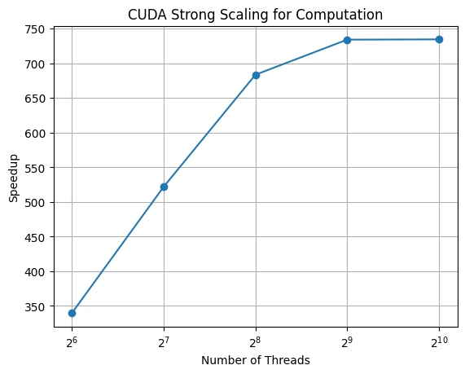
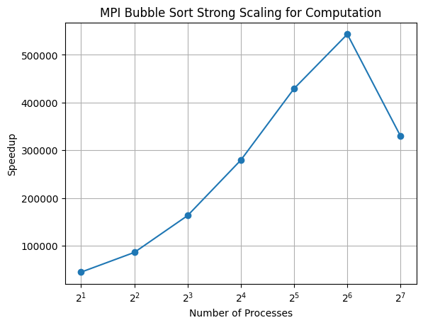
<br>
Both of these graphs were generated using an input size of $2^{20}$. Speedup increases for both the CUDA and MPI implementations as the number of threads/processes increases showing that this has good strong scaling. The one exception to this trend is that speedup decreases once the number of processes reaches 1024 in the MPI implementation.

#### Weak Scaling
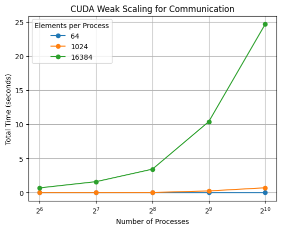

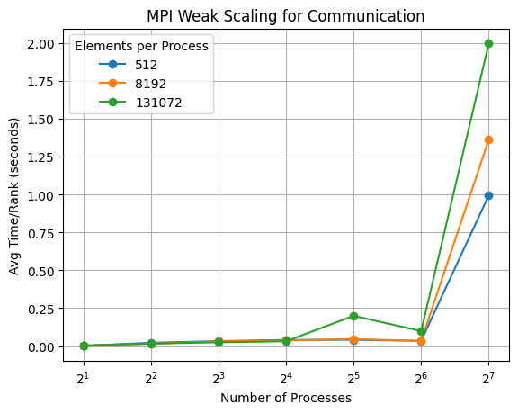

<br>
This is an example of poor weak scaling since the time increases as the number of threads/processes increases. If the algorithm had good weak scaling, the lines would be relatively flat.

#### Input Types
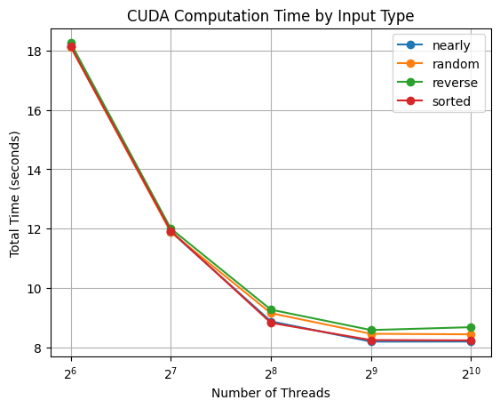
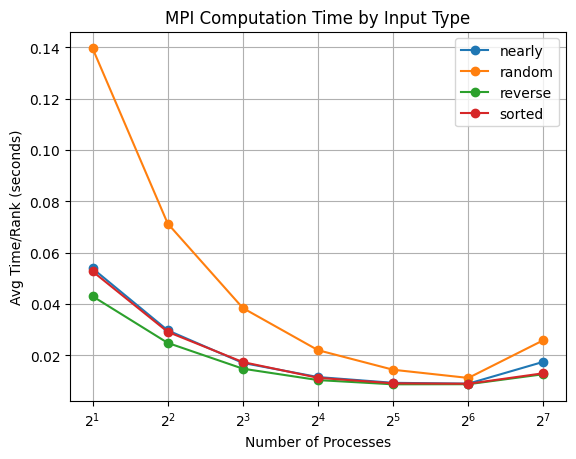
<br>
Both of these graphs were generated using an input size of $2^{20}$. Computation time is not affected by the input type for the CUDA runs, however random         input sees a significant increase in runtime for MPI.

#### Communication vs Computation
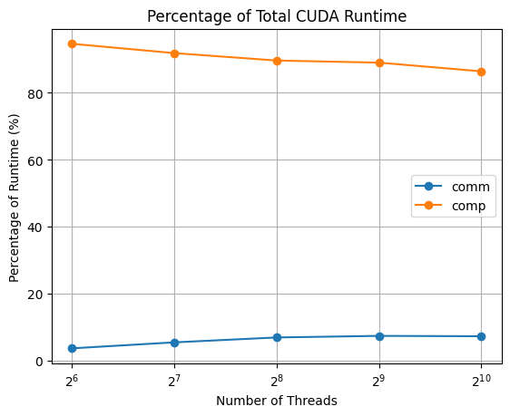
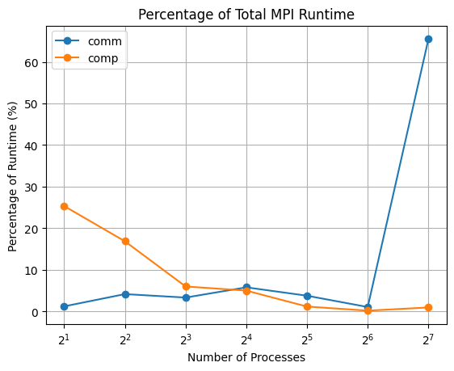
<br>
Both of these graphs were generated using an input size of $2^{20}$. For the CUDA implementation, the communication and computation take up roughly the same percentage of the total time no matter the number of threads. For the MPI, implementation, the computation time takes up a lower percentage of the total time as the number of processes increases. The communication time slightly increases from 2 to 64 processes before spiking up to over 60% at 128 processes.

### Merge Sort
#### Strong Scaling


#### Weak Scaling


#### Input Types

#### Communication vs Computation

### Selection Sort
#### Strong Scaling
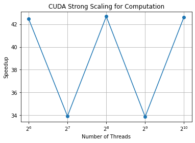
<br>
The Strong scaling here is very random, and varies up and down for speedup with different numbers of CUDA threads. This may be due to the inefficiency of using CUDA GPU for selection sort, since the whole array is traversed. This will be tried with a larger array size as well to test if speedup is more evident.

#### Weak Scaling
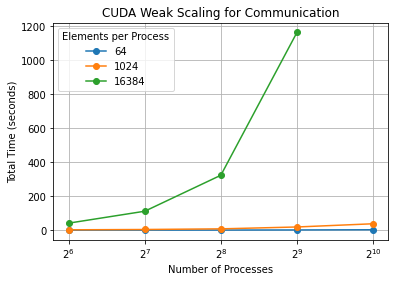

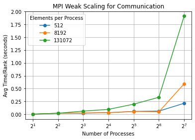

<br>
The weak-scaling looks decent for MPI, and bad for CUDA, but bad for both with super large process sizes. This may be due to the exponential nature of the sort with selection sort, or the inefficient caching with CUDA GPUs.

#### Input Types
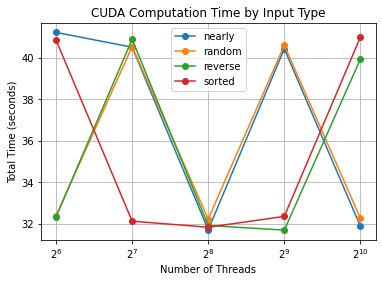
<br>
This looks very random for input types, but varies only a little. Selection sort is unlikely to change given the input, so this is as expected.

#### Communication vs Computation
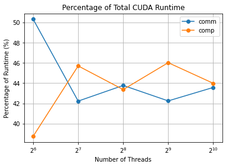
<br>
The communication and computation time varies only a little bit. Since the amount of communication doesn't change much with more processors for GPU usage, it is unlikely to change the relationship between communication and computation much. This might be worth looking at for larger problem sizes however.

### Quick Sort
#### Strong Scaling
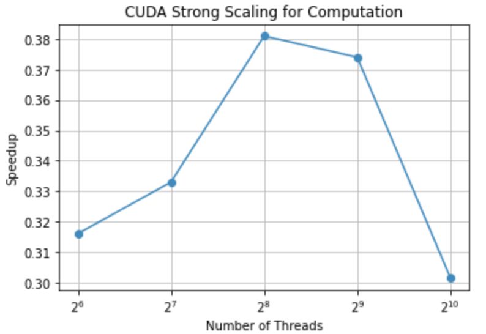
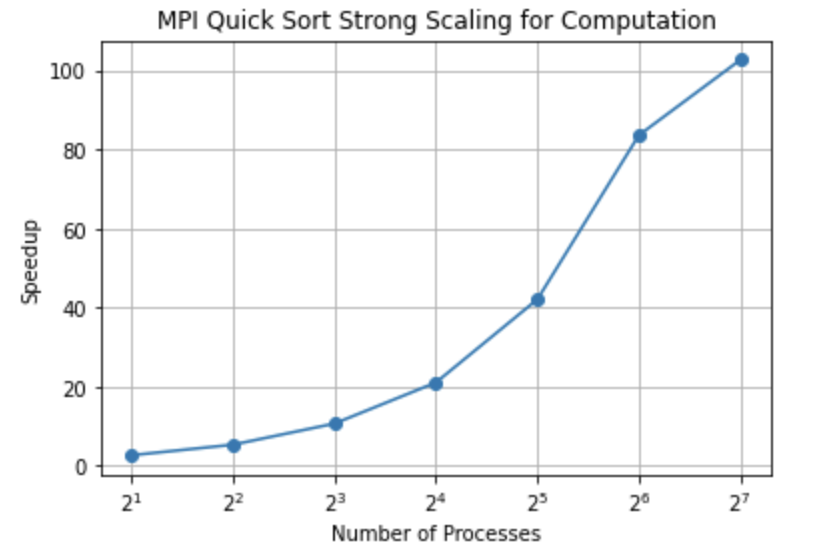
<br>

#### Weak Scaling

#### Input Types
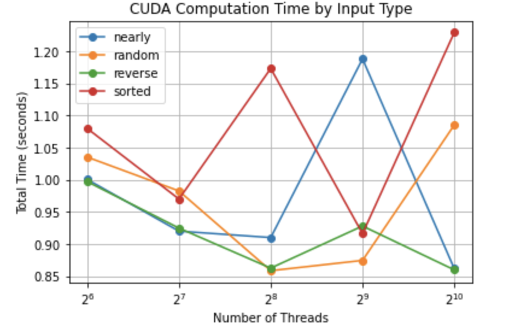

#### Communication vs Computation
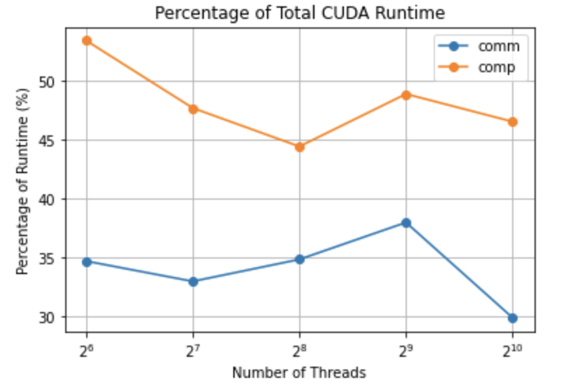
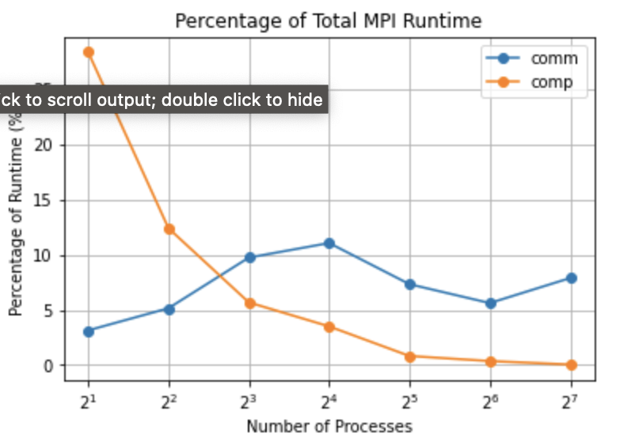

### Algorithm Comparisons

## 5. Presentation

## 6. Final Report
Submit a zip named `TeamX.zip` where `X` is your team number. The zip should contain the following files:
- Algorithms: Directory of source code of your algorithms.
- Data: All `.cali` files used to generate the plots separated by algorithm/implementation.
- Jupyter notebook: The Jupyter notebook(s) used to generate the plots for the report.
- Report.md
