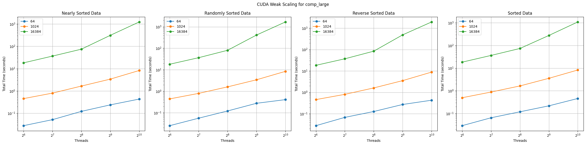
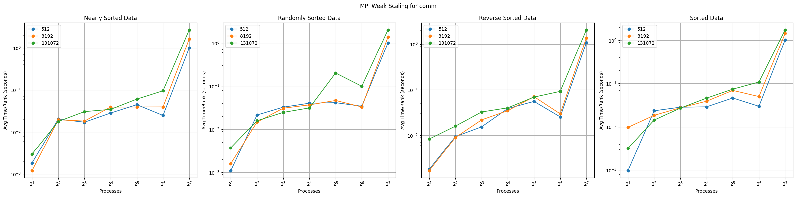
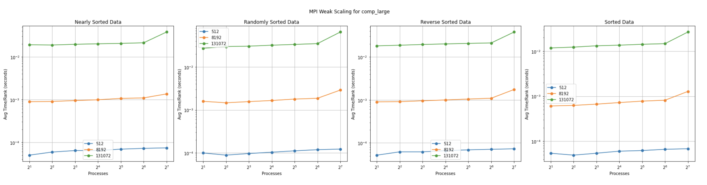
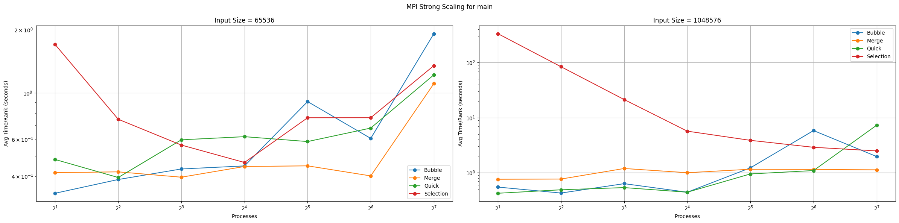

# CSCE 435 Group project

## 0. Group number: 
Group #3

## 1. Group members:
We will communicate using Discord during the duration of the project.
1. Robbie Clark
2. Eric Lee
3. Rushil Aggarwal
4. Ananth Kumar 

## 2. Project topic (e.g., parallel sorting algorithms)
Parallel Sorting Algorithms

### 2a. Brief project description (what algorithms will you be comparing and on what architectures)
1. Bubble Sort (Sequential) / Odd-Even Sort (Parallel)
    - Sequential
    - Parallel using MPI
    - Parallel using CUDA
2. Merge Sort
    - Sequential
    - Parallel using MPI
    - Parallel using CUDA
3. Selection Sort
    - Sequential
    - Parallel using MPI
    - Parallel using CUDA
4. Quick Sort
    - Sequential
    - Parallel using MPI
    - Parallel using CUDA

### 2b. Pseudocode for each parallel algorithm
- For MPI programs, include MPI calls you will use to coordinate between processes
- For CUDA programs, indicate which computation will be performed in a CUDA kernel,
  and where you will transfer data to/from the GPU

1. Bubble Sort (Sequential)
    ```python
    def bubble_sort(array):
        i = array.length - 1
        sorted = False
        while i > 0 and not sorted:
            sorted = True
            for j=1 to i-1:
                if a[j-1] > a[j]:
                    swap a[j-1] and a[j]
                    sorted = false
            i -= 1
    ```
2. Odd-Even Sort (MPI)
    ```
    rank = rank of process
    num_procs = total number of processes
    n = local_array.length
    sort(local_array)

    for i to n:
        // even step
        if i % 2 == 0:
            partner = rank-1 if odd rank and rank+1 if even rank
            if partner >= 0 and partner < num_procs:
                //MPI_SendRecv local_array with partner rank
                if rank % 2 == 0:
                    local_array = //min half of combined data (local & partner array)
                else:
                    local_array = //max half of combined data (local & partner array)

        // odd step
        else:
            partner = rank+1 if odd rank and rank-1 if even rank
            if partner >= 0 and partner < num_procs:
                //MPI_SendRecv local_array with partner rank
                if rank % 2 == 0:
                    local_array = //max half of combined data (local & partner array)
                else:
                    local_array = //min half of combined data (local & partner array)
    ```

3. Odd-Even Sort (CUDA)
    ```c++
    def OddEvenSortStep(float* nums, int size, int i) {
        index = // get either MPI rank or index using CUDA
        // Odd step
        if (i == 0 && (index * 2 + 1) < size) {
            if(nums[index * 2] > nums[index * 2 + 1]) {
                swap(nums[index * 2], nums[index * 2 + 1]);
            }
        }
 
        // Even step
        if (i == 0 && (index * 2 + 2) < size) {
            if(nums[index * 2 + 1] > nums[index * 2 + 2]) {
                swap(nums[index * 2 + 1], nums[index * 2 + 2]);
            }
        }
    }

    def OddEvenSort(float* nums, int size) {
        //memcpy host to device
        for (i = 1; i <= size; i++) {
            // performed in a CUDA Kernel
            OddEvenSortStep(nums, size, i%2);
        }
        //memcpy device to host
    }
    ```
4. Merge Sort (Sequential)
    ```python
    def merge_sort(array):
        total_length = array.length
        if total_length < 2:
            return array
            
        midpoint = total_length / 2
        left = merge_sort[0:midpoint]
        right = merge_sort[midpoint:total_length]
        l_index = 0
        r_index = 0
        final_array = []

        while l_index < left.length and r_index < r.length:
            if left[l_index] < r[r_index]:
                final_array.append(left[l_index])
                l_index += 1
        else:
            final_array.append(right[r_index])
            r_index += 1

        #catch extraneous values
        while l_index < left.length:
        final_array.append(left[l_index])
        l_index += 1
        while r_index < right.length:
        final_array.append(right[r_index])
        r_index += 1
    ```
5. Merge Sort (CUDA)
    ```
    __device__ void merge()
        serial merge implementation
    __global__ void mergeSort(data, size of data 'n')
        tid = threadindex
        for i to n stepping by *2 //this is for going from size 1 arrays then merge to 2 then 4 etc.
            for left = tid * 2 * currsize; left < n-1; left += gridDim * 2 * currSize
                mid = min(left + currsize-1, n-1)
                right = min(left + 2 * currsize - 1, n - 1);
                merge(data, left, mid right)
    main()
        numBlocks = size of data/numthreads per block
        mergeSort<<numBlocks, numThreads>> (inputdata, size of data)
    ```

6. Merge Sort (MPI)
    ```
    void merge()
        serial merge implementation
    void mergesort()
        serial mergeSort implementation
    void main()
        Do MPI initializiation (init, comm, etc)

        if root:
            distribute work to workers
            work on your own chunk of data
            receive data from other threads and do final merge
        else:
            get work from master process
            do mergeSort on your data
            send sorted data back to master
    ```
7. Selection Sort (Sequential)
    ```python
    def sort(arr):
        for start_index in arr:
            min_value = arr[start_index]
            min_index = start_index
            for index from start to arr.size:
                if arr[index] < min_value:
                    min_index = index
                    min_value = arr[index]
            swap arr[start_index] and arr[min_index]
    ```
8. Selection Sort (CUDA)
    ```python
    def host_sort(arr):
        load arr into gpu
        load min_val into gpu
        for start_index in arr:
            set min_val to max_int  
            min_val = gpu_min(arr from start_index to end)
            min_index = gpu_index(min_val, arr from start_index to end)
            gpu_swap(arr[min_index] and arr[start_index])
    
    def gpu_min(value): #gpu function on each value
        min_val = atomic_min(min_val, arr[value])
    
    def gpu_index(value): #gpu function on each value
        if arr[value] == min_val:
            min_index = value
    
    def gpu_swap(val1, val2) #gpu function called once
        atomic_swap(arr[val1], arr[val2])

    ```
9. Selection Sort (MPI)
    ```python
    def mpi_sort(array):
        scatter array to p procs in local_array
        selection_sort(local_array) for each proc
        gather local_arrays into array
        for i from p/2 to 0, dividing by 2:
            for j from 0 to i, adding by 1:
                send 2 sorted arrays to proc j
                merge(arr1, arr2)
                receive merged array
                put back into array

    def selection_sort(array):
        same as sequential selection_sort

    def merge(arr1, arr2):
        same as sequential merge_sort_step
        send to master process

    ```
10. Quick Sort (Sequential)
    ```c++
    int partition(int* nums, int low, int high){
    int pivot = nums[high];

    int i = (low - 1);
    
    for(int j = low; j < high; j++){
        if(nums[j] < pivot){
            i++;
            swap(nums[i], nums[j]);
        }
    }

    swap(nums[i + 1], nums[high]);

    return i + 1;
    }

    void quick_sort(int* nums, int low, int high) {
    if(low < high){
        int pi = partition(nums, low, high);

        quick_sort(nums, low, pi - 1);
        quick_sort(nums, pi + 1, high);
    }
    }
    ```
11. Quick Sort (CUDA)
    ```c++
    void quick_sort_step(int* dev_nums, int left, int right){
        int stack[64];
        int top = -1;
    
        stack[++top] = left;
        stack[++top] = right;
    
        while (top >= 0) {
            right = stack[top--];
            left = stack[top--];
    
            int pivotIndex = partition(dev_nums, left, right);
    
            if (pivotIndex - 1 > left) {
                stack[++top] = left;
                stack[++top] = pivotIndex - 1;
            }
    
            if (pivotIndex + 1 < right) {
                stack[++top] = pivotIndex + 1;
                stack[++top] = right;
            }
        }
    }
    void quick_sort(int* nums){
        for(int i = 0; i < NUM_VALS; i++){
            //perform cuda kernel call
            quick_sort_step(dev_nums, 0, i);
        }
    }
    ```
12. Quick Sort (MPI)
    ```c++
    void quicksort(int* arr, int start, int end){
        int pivot, index;
        if (end <= 1)
            return;
        pivot = arr[start + end / 2];
        swap(arr, start, start + end / 2);
        index = start;
        for (int i = start + 1; i < start + end; i++) {
            if (arr[i] < pivot) {
                index++;
                swap(arr, i, index);
            }
        }
        swap(arr, start, index);
        quicksort(arr, start, index - start);
        quicksort(arr, index + 1, start + end - index - 1);
    }

    int* merge(int* arr1, int n1, int* arr2, int n2){
        int* result = (int*)malloc((n1 + n2) * sizeof(int));
        int i = 0;
        int j = 0;
        int k;
    
        for (k = 0; k < n1 + n2; k++) {
            if (i >= n1) {
                result[k] = arr2[j];
                j++;
            }
            else if (j >= n2) {
                result[k] = arr1[i];
                i++;
            }
    
            else if (arr1[i] < arr2[j]) {
                result[k] = arr1[i];
                i++;
            }
            else {
                result[k] = arr2[j];
                j++;
            }
        }
        return result;
    }

    int chunk_size = (size % num_procs == 0) ? (size / num_procs) : size / (num_procs - 1);
    int* chunk = (int*)malloc(chunk_size * sizeof(int));
    // DO MPI_Scatter
    int own_chunk_size = (size >= chunk_size * (proc_id + 1)) ? chunk_size : (size - chunk_size * proc_id);
    quicksort(chunk, 0, own_chunk_size);
    if (rank_of_process % (2 * step) != 0) {
        //Do MPI_Send
        }
    if (rank_of_process + step < number_of_process)
        // DO MPI_Recv
        nums = merge(chunk, own_chunk_size, chunk_received, received_chunk_size);
    ```

#### Sources Used
1. https://selkie-macalester.org/csinparallel/modules/MPIProgramming/build/html/oddEvenSort/oddEven.html (Odd-Even MPI)
2. https://rachitvasudeva.medium.com/parallel-merge-sort-algorithm-e8175ab60e7 (Merge Sort Parallel)
3. https://www.geeksforgeeks.org/implementation-of-quick-sort-using-mpi-omp-and-posix-thread/ (Quick Sort MPI)


### 2c. Evaluation plan - what and how will you measure and compare
- Input Type: For each algorithm, the data type being sorted will be floats. There will be using 4 different types of data generation which include, sorted, reverse sorted, nearly sorted, and random. 
- Input sizes: The array will have 2<sup>16</sup>, 2<sup>20</sup>, or 2<sup>24</sup> values.
- Threads per GPU Block: Each block will have 64, 128, 256, 512, or 1024 threads.
- MPI Processes: The number of processes will be 2, 4, 8, 16, 32, 64, or 128.
- Scaling: We will be performing strong scaling for each given problem size. By scaling in this fashion we can also look at weak scaling by comparing performance across different problem sizes.


## 3. Project implementation
Implement your proposed algorithms, and test them starting on a small scale.
Instrument your code, and turn in at least one Caliper file per algorithm;
if you have implemented an MPI and a CUDA version of your algorithm,
turn in a Caliper file for each.

### Algorithm Descriptions
1. Bubble Sort (Sequential): Each iteration of a bubble sort starts at the beginning of the array, comparing adjacent indices until it reaches the end of the array, swapping elements when necessary. The range of indices that will be compared for any given iteration is 0 to N-iterations-1. The algorithm will stop after N-1 iterations or if no swaps occur during a given iteration, indicating the array is already sorted. The runtime of sequential bubble sort is $O(n^2)$.
2. Odd-Even Sort (CUDA): Odd-Even sort is a parallel implementation of bubble sort. When implemented on CUDA, the algorithm starts by copying the starting array from the host to the device. Next, N iterations of the sort are run in the CUDA kernel. For each odd iteration, the odd indices will be compared with the element to its right. For each even iteration, the even indices will be compared with the element to its right. After the kernel is done computing, the sorted array will be copied from the device back to the host. The runtime of CUDA odd-even sort is $O(\frac{n^2}{p})$.
3. Odd-Even Sort (MPI): Odd-Even sort in MPI starts with each ranking locally sorting its data using a built-in sort of choice. P iterations of the sort are then run. For each odd iteration, odd ranks will use MPI_Sendrecv to swap data with the rank 1 above them. The even rank will retain the highest 3 numbers while the odd rank will retain the lowest 3 numbers with both sets remaining in ascending order. For each even iteration, even ranks will use MPI_Sendrecv to swap data with the rank 1 above them. The even rank will retain the lowest 3 numbers while the odd rank will retain the highest 3 numbers with both sets remaining in ascending order. Finally, after all iterations are complete, each process's data will be gathered into a single sorted array using MPI_Gather. The runtime of MPI odd-even sort is $O(\frac{n^2}{p})$.
4. Merge Sort (Sequential): Merge sort works by breaking an array into smaller and smaller subarrays until they are only of size one. Once that is complete, the subarrays "merge" with their neighbors and are combined back together, only now do we do comparisons to see which should come first. We do this comparison between the two sorted subarrays' elements of the subarray until we complete our merge steps and we are left with a sorted array. The runtime is $O(nlogn)$
5. Merge Sort (CUDA): Parallelizing merge sort with CUDA is done in a similar way to the sequential version of the sort, only we are giving each thread its only local block of the initial data as a small subarray. We then on separate threads call a sequential merge and then once the threads all finish the same depth of merge, we start the merge process again on the next level up in parallel. This process is repeated until we reach our full sorted array. The runtime is $O(\frac{nlogn}{p})$.
6. Merge Sort (MPI): Parallelizing merge sort with MPI is done in a similar way to the sequential version of the sort, only we are giving each thread its only local smaller version of the initial data as a small subarray. We have our master process scatter work between the rest of the processes which then all commit to their own serial merge. After this is complete, all of the threads return their sorted arrays and the master process commits to merging those together until we have our final sorted array. The runtime is $O(\frac{nlogn}{p})$.
7. Selection Sort (Sequential): Selection Sort (Sequential): Each iteration starts at a new index from the left and goes through the array. Each iteration finds the minimum element of the array from that point on and swaps it into that starting index. This algorithm will always stop after N iterations. The runtime is $O(n^2)$.
8. Selection Sort (CUDA): Selection Sort (CUDA): Each iteration is the same, starting at a new index from the left and going through the array. Each iteration finds the minimum element in parallel, with each cuda thread comparing its element to a shared minimum address. Once the minimum is found, the address of it is found and then swapped with the starting index. The runtime of the CUDA selection sort is $O(\frac{n^2}{p})$.
9. Selection Sort (MPI): Selection Sort (MPI): The MPI implementation of selection sort splits the array into P parts, performing a sequential selection sort on each as described above. Then, gathering the array, pairs of the sorted lists are merged into larger sorted lists in parallel akin the the parallel merge sort. The runtime of this MPI selection sort is $O(\frac{n^3}{p^2})$.
10. Quick Sort (Sequential): QuickSort is the sorting algorithm based on the divide-and-conquer method. Where the array is divided by a selected value in the array called the pivot. All the values left of the pivot are smaller than the pivot and all the values to the right of the pivot are larger than the pivot. Then the sorting algorithm will recursively sort the elements of the two arrays by picking another pivot in the arrays and having two more arrays with the left values being smaller than the pivot and so on and so forth until all the elements are sorted. Once the elements are sorted, the algorithm will merge the smaller arrays into one array that is fully sorted. The runtime of quicksort is $O(nlogn)$ time because dividing the array into smaller arrays takes n of time and merging the arrays takes logn time.
11. Quick Sort (CUDA): Quicksort implementation in CUDA is done by first copying the array from the host to the device. Then, the array is sorted in the CUDA kernel N times. Then the quicksort algorithm will sort the elements by using a pivot and recursively sort the left and right arrays, and then will merge the arrays. After the array is sorted by the kernel, the sorted array will be copied from the device back to the host. The runtime for quicksort in CUDA is $O(\frac{nlogn}{p})$ as it's just the sequential runtime of quicksort divided by the number of processors being used.
12. Quick Sort (MPI): The implementation of quicksort in MPI is by first dividing the array into chunk sizes. All the processes get the size of the array from MPI_Bcast which the root process broadcasts to the other processors. Then MPI_Scatter to scatter the chunk size information to all the processes. Then the processors will calculate their own chunk size and then sort the chunks with quicksort. Then once the processor does quicksort it sends their chunk to another processor based on a tree-based reduction pattern. Then a processor will receive a chunk from another processor using MPI_Recv and then the chunk will be merged together. This will continue until all the chunks are merged together. The runtime for quicksort in MPI is $O(\frac{nlogn}{p})$ as it's just the sequential runtime of quicksort divided by the number of processors being used.

## 4. Performance evaluation
Note: "nearly" is substituted for "1%pertubed", this change is in name only.

### Bubble Sort
#### Strong Scaling CUDA


The runtimes for input size of $2^{16}$ have no discernible pattern due to not fully seeing the effects of parallelization. For the larger input sizes, a clear pattern emerges in the computation, communication, and overall times. For comp_large, the total time decreases as the number of threads increases. As far as the different input types go, ordering from least time to greatest time they are as follows: sorted, nearly, random, and reverse. They are generally in this order at each thread count and input size. For communication times, the nearly and random input types are noticeably larger than the reverse and sorted times. One possible cause for this is that the rng calls in the data generation are somehow affecting the time it takes memcpy to run. The overall runtimes largely follow the same trends as the computation times, showing that it has a much larger influence over the total runtime than communication does.

#### Strong Scaling MPI


For computation times, the average time per process generally decreases as the number of processes increases. The exception to this is when the input size is $2^{16}$, the times begin to increase after the number of processes exceeds 16. Additionally, when the input type is random, the time is significantly higher than the other input types, especially on lower process counts. The communication times stay relatively consistent until the process count reaches 128, where the time skyrockets. The overall time mostly increases as the process count increases, except for the largest input size, where it decreases at first before increasing again. This is likely a result of the time saved during computation becoming a bigger factor as time increases again, but it still cannot counteract the large spikes in communication time.

#### Speedup CUDA


The speedup for the computation and overall times increases quickly initially before leveling off or slightly dropping at the highest thread counts. For the nearly and sorted data, the speedup also increases as the input size increases, but strangely for the random and reverse sorted data, the middle input size ($2^{20}$) has the highest speedup. The communication speedup is almost non-existent for the nearly and randomly sorted data, barring a few outliers. For the reverse and sorted data, there is a slight increase in speedup for the middle input size and a more significant one for the largest input size.

#### Speedup MPI


The speedup for the computation increases in a linear pattern before falling off around 16 processes for the small input size and at 64 processes for the other input sizes. The speedup for the communication actually decreases as the number of processes increases. The conflicting speedup trends between computation and communication lead to the overall speedup looking a bit messy. The largest input size sees an increase in speedup followed by a decrease, while the other input sizes mostly just decrease in speedup. This shows that communication has more of an effect on the overall runtime than computation.

#### Weak Scaling CUDA



For computation, communication, and overall, the times increase linearly as the number of threads increases. The one exception to this is when the size per thread is 64, which sees a decrease in communication time as the number of threads increases. This algorithm is a poor example of weak scaling since the lines are not flat.

#### Weak Scaling MPI




For computation times, the times increase as the number of processes increases. The communication times see a large spike between 2 and 4 processes and another between 64 and 128 processes. The values in between stay consistent or slightly increase. The overall times generally increase as the number of processes increases but see some larger spikes at the lowest and highest process count, very similar to the communication times. This is due to the communication having a large influence on the overall runtime.

#### Communication vs Computation


Both of these graphs were generated using an input size of $2^{20}$. For the CUDA implementation, the communication and computation take up roughly the same percentage of the total time no matter the number of threads. For the MPI, implementation, the computation time takes up a lower percentage of the total time as the number of processes increases. The communication time slightly increases from 2 to 64 processes before spiking up to over 60% at 128 processes.

### Merge Sort
#### Strong Scaling CUDA


Looking at the graphs from all three input sizes, we can see that there is no discernable improvement in computation from an increase in the number of threads on the GPU. We can also see specifically in the largest input size case that a reverse sorted list sorts faster than an already sorted list. Communication is also constant across all numbers of threads, which is expected since the communication from device to host is identical regardless of the number of threads. It can be seen in the graphs for main that the majority of the time spent in the algorithm is in computation. I think this plateauing behavior comes from the fact I have to create more kernel calls as the input size increases so that ends up becoming the bottleneck and not the actual computation inside the kernel itself. I also have a final merge step that occurs on the CPU so this could be another point of slowdown for the program.

#### Strong Scaling MPI


Contrasting the CUDA implementation we can see that the MPI implementation of merge sort has major improvements in computation time with an increase of threads. As we reach the high thread counts, however, there are diminishing returns from this extended parallelism.

For communication, there is this reoccurring spike in runtime at 32/64 threads. This is most likely due to us having to jump between nodes at this thread count range, causing a major increase in the cost of communication.

As we see in the main function graphs for MPI, we aren't really benefitting from parallelism until we hit our largest input size, where we start to see a really defined behavior. We also see the major performance hit we take from this increase in communication cost and how it outweighs any benefit from the extended amount of parallelism we had from the computation steps.

#### Speedup CUDA


For CUDA the speedup graph shows that we get NO performance benefit, in fact, it's a lot worse! This deterioration in performance is implementation-specific, with the aforementioned issues with multiple kernel calls and CPU merge steps. (A previous implementation I had could potentially experience speed up if it could handle input sizes larger than 2^16). It is very apparent in the comp_large graph for the input size of 2^16. 

#### Speedup MPI


We can see a major improvement with MPI. As we mentioned before with the slowdown at 2^6/2^7 we lose some performance gain so the speed up goes down, but overall we trend upwards in terms of how fast our algorithm can complete the sort as we increase threads. The speedup seems almost identical for comp across all input sizes and types. For communication we see a strange large spike in speedup going from 2 to 4 threads, it could be that the host can more quickly communicate out the smaller chunks due to fewer cache misses. It seems that we peak in an overall speedup of main is at 2^4 (16) threads.

#### Weak Scaling CUDA


We see in our weak scaling for CUDA in both the communication and computation that there is a shallow linearly increasing relationship in runtime as we increase the number of threads while keeping the number of elements per thread the same. This is expected as a correlated increase in the number of processors and elements in the context of parallel merge sorts bigO of nlog(n)/p. As n increases and p increases, the log(n) term would make the numerator scale slightly higher.

#### Weak Scaling MPI


We see in our weak scaling for MPI that in computation, we have a flatter curve than we did in CUDA, this could be due to the merge sort implementation being higher performing in this implementation. We see the same spike in communication costs at 2^7 for the largest input size, again for the fact that we have to communicate large data across nodes.

#### Communication vs Computation


We see in CUDA that a vast majority of the run time comes from the computation and the rest of the time comes from communication. Both quantities seem to hold mostly constant across all thread counts. This is expected as the amount of data regardless of thread count that is being sent between the device and host is the same (so there shouldn't be a time difference). The computation taking the same amount of time across all thread counts is a fault of the algorithm implementation.


For CUDA we see that as we increase parallelism less and less of the total time is being spent on computation but for communication, it stays relatively the same. This makes sense since the computation goes faster. There is a step that isn't accounted for here since there is a loop that pushes back on a vector that runs n times which takes more and more time as we increase thread counts.

### Selection Sort
#### Strong Scaling CUDA


For CUDA, the communication time stays consistent with the number of processes. This is because the only communication that happens is transferring the data to and from the device, which is constant with each implementation. The total computation time remains roughly the same since the number of comparisons necessary does not change. The implementation of the algorithm only parallelizes the input to a degree where it can be handled by one block in the GPU, so increasing the number of threads does not scale well for CUDA.

#### Strong Scaling MPI


The computation time decreases with an increase in processors. This is because the size of the individual selection sorts on the partion of data in each process is smaller, allowing the individual sorts to complete faster. Communication time does increase as a factor, since more threads are communicating to merge sorted subarrays. In general, the decrase in computation time improves the performance with more processors, since the individual sorts are the slowest step.

#### Speedup CUDA


The CUDA implementations generally don't speedup as the number of threads increases. This is because the algorithm was written to sort fixed-size blocks at a time using selection sort, so increasing the number of Threads would not improve performance. The performance using arrays of size $2^{20}$ may be due to the time required to startup more unused GPU threads or synchronize with unused threads.


#### Speedup MPI


The MPI graphs generally show speedup as the number of processes increase. The speedup is most notable in computation time, which is due to the smaller subarrays being sorted with selection sort. The decrease in speedup for communication is due to the increase in communication with more processes. The overall time generally follows the speedup of computation, but varies a bit since the smaller problem sizes may lead to the speedup of more processes mattering less in the overall runtime.

#### Weak Scaling CUDA


There is a linear increase in the time per rank for the CUDA implementation. This is because the increase in the problem size require more merging at the end which is relatively slow in comparison to the individual GPU sorting steps, leading to a linear increase in time. This is reflected in both the communication and computation times increasing, as the later stages take more time.

#### Weak Scaling MPI


The MPI implementation does weak scaling well. This is because the most time consuming part is the sorting of the individual arrays for the MPI implementation, which remains constant since the number of values sorted at this step remains constant. The merge step after that is much quicker, so it barely affects the overall runtime as the problem size increases. This can be seen as the communication time generally increases for the merge step, but the computation and total time remain generally constant.


#### Communication vs Computation

The CUDA implementation is mostly computation, as the only communication that happens is moving values from device to host and host to device, which are relatively quick and increase linearly. The computation in sorting increases more than linearly, so the share of communication does not increase. For MPI, the implementation requires more communication with more threads. Since each are broadcasting their own sorted subarrays after completion, mroe communcation is happening. with more threads. The computation also becomes significantly smaller since the subarray each process sorts is smaller, leading to a decrease in the percentage of time spent doing computation.

### Quick Sort
#### Strong Scaling CUDA


For Cuda strongly scaling the comp graphs at first glance are all over the place regardless of the input size. However, looking at the y-axis the numbers differ by like 0.1 showing that quicksort has a very bad strong scaling for comp. For comm, the lines are straight for all input types on each input size but reverse and random are slower than nearly and sorted input types. Then for main most of the trend lines are straight with slight disparity for each line but they are mostly straight.


#### Strong Scaling MPI


For MPI strong scaling the comp graphs had the same trends regardless of the input size. As the number of processors increases the average time/rank decreases showing good strong scaling for comp. For comm, the trend lines are pretty steady until reaching 128 threads which causes all the input sizes regardless of input type to shoot up indicating that comm slows down when there's too many processors. Then for main the strong scaling shows an upward trend in time as the processors increase but there's some outliers like reverse sort for 2^24 shoots up then for 128 processors it shoots back down. These trends indicate that the strong scaling is really effective for computation and not for the rest.

#### Speedup CUDA


For Cuda the speedup is all over the place for comm, comp and main at first glance. However, looking at the y-axis the disparity of the numbers are really small. That means for cuda there wasn't any speedup being done as the processors increase which could be down to the quick sort source code not be correctly parallized.

#### Speedup MPI


The speedup for MPI has certain patterns for comm, comp and main regardless of the input type. For comp the speedup increases as the processors increase but the larger two input sizes tee-off at the highest processors count. For comm, the speedup decreases as the processors increase. For main, the 2^16 and 2^20 and somewhat consistent and the speedup decreases as the processors increase. However, for 2^24 in main the speedup increase then starts decreases as the number of processors increase which might be due the splitting of data into chunks and merging the chunks back together.

#### Weak Scaling CUDA


The cuda weak scaling is better than the mpi weak scaling as seen by the y-axis. The time goes up as the processors go up for each input type and for comp, comm, and main. However, the increase of the lines is very small, so if the graph was zoomed out the lines would be straight but zoomed in as the graphs shows that the data isn't the strongest weak scaling. 

#### Weak Scaling MPI



The mpi weak scaling is not the strongest as the processors increase when the time. However, the weak scaling is much better for comp_large compared to comm and main. For main and comm for sorted data there are some outliers causing the weak scaling to not be very strong.

#### Communication vs Computation


As seen in the graphs the comp time decreases as the number of threads increase for both cuda and mpi but the mpi is a lot more efficient
then my cuda and the reason why this could be is because of my implementation of cuda and mpi being different and my cuda not being that efficient compared to my mpi. Also for both mpi and cuda the comm time % increases at the threads going up because comm time doesn't decrease from parallelism so the percentage of comm time will increase if comp time decreases.

### Algorithm Comparisons
#### Strong Scaling CUDA


For computation times, quick sort consistently is the quickest algorithm by a substantial amount. For the smallest input size, bubble and merge sort have similar performance, with merge being slightly faster, and selection sort has the worst performance. For the medium input size, merge sort becomes slightly worse than bubble sort. For the largest input size, bubble sort becomes the slowest algorithm followed by merge, selection, then quick. Communication times are the slowest for bubble sort and the fastest for quick sort. Selection sort and merge sort have similar performance. These trends are true for every input size. The overall runtime is almost identical to the computation times since they make up the majority of the total time.

#### Strong Scaling MPI




For computation times, quick sort is the quickest algorithm, followed by bubble sort, merge sort, and then selection sort. Merge sort has the quickest communication time with the other 3 algorithms having similar times. Overall times vary based on the input size with the smaller input size having all 4 algorithms pretty close in time but merge generally being the fastest. For the larger input size, bubble and quick sort are the fastest for the lower process counts with merge being the fastest for higher process counts, and selection sort generally being the slowest.

#### Weak Scaling CUDA


As we do weak scaling for our CUDA algorithms, we see that quick sort has the most "stable" with a very shallow increase in runtime across all input sizes per thread count. The other three algorithms trend in a similar fashion but merge sort seems to deviate a lot more compareatively at the 1024 inputs per thread size at thread counts larger than 2^8.

Communication-wise all of our algorithms seem to trend towards scaling similarly as we increase input per thread size. At the lowest input per thread size (64) we see that bubble largely deviates but as we look at the y-axis, we can see that the variance is actually very small if not negligible. 

The main graphs take the shape of the computation portion as that is what takes up most of the time for these algorithms in CUDA. So the observations made in the computation portion hold mostly true here. The only major observable deviation is with bubble sort at the 64 size because the communication bumps up the run time but since the overall time that it takes to run is so small it could look like this due to a stochastic change in the hardware environment.

#### Weak Scaling MPI


For weak scaling MPI for the computation quick sort is fastest followed by bubble, merge, and then selection sort except for process size 512 where bubble sort gradually increases. Furthermore most of the trend lines are straight except for the bubble sort in process size 512 which is showing decent strong scaling. Then for comm, merge sort has the quickest run time and the other three sorts are bunched together, and their lines are increased as the process increases showing bad weak scaling. Then for main, all the sorts are interwoven except for selection sort for process size 131072, and all the trendlines are increasing as the processors increase showing bad weak scaling.
